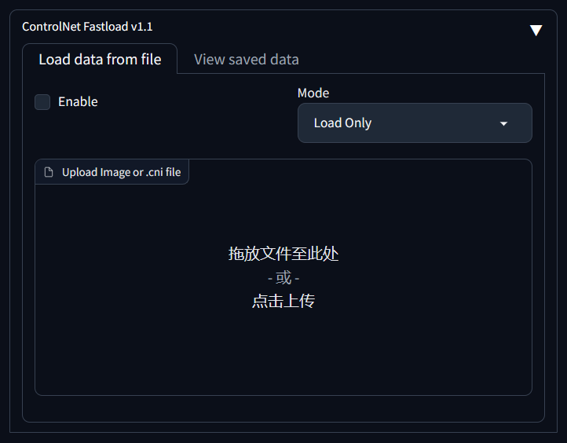
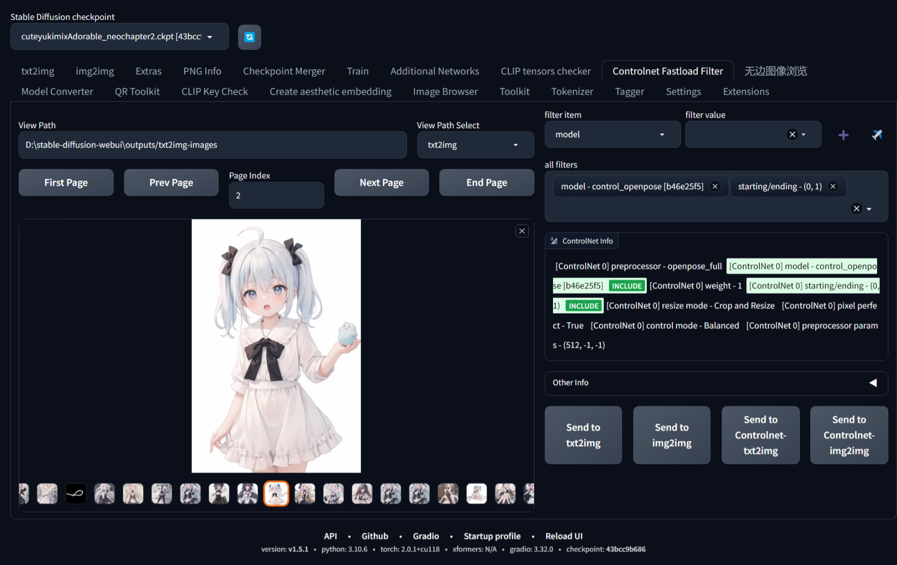

# sd-webui-controlnet-fastload
一个用于 `stable-diffusion-webui` 的扩展。    
[English Documentation](README.md)

## 功能
- 可以保存[Controlnet插件](https://github.com/Mikubill/sd-webui-controlnet)的参数
- 将Controlnet参数直接嵌入到图像中或保存在单独的文件中,以便分享
- 从嵌入Controlnet参数的图片或文件快速加载参数到txt2img或img2img中
- 可以在UI下使用, 或通过API调用
- 可选功能`isEnabledManualSend`**可以让你在这个插件下完成出图的全部前期准备**
- `Controlnet Fastload Filter` Tab可以**根据ControlNet参数**导入图片

## 预览
### 主功能

### 预览嵌入信息

### Controlnet Fastload筛选Tab


https://github.com/pk5ls20/sd-webui-controlnet-fastload/assets/114645197/054dcbd2-3f04-4d56-9339-e119a2eeed46

## 使用方法
### 用户界面
开箱即用   
> 你可以在设置中调整插件偏好或启用`isEnabledManualSend`

### Web API
#### 与`/sdapi/v1/*2img`集成使用 

在与`/sdapi/v1/*2img`集成使用时你只能得到处理好的图片本体   
需要将`/sdapi/v1/*2img`与下面提到的`/controlnetFastload/fetch`结合使用来得到ControlNet的数据

这是一个在`/sdapi/v1/txt2img`使用的示例：
```json
{
    "prompt": "1girl",
    "batch_size": 1,
    "steps": 20,
    "cfg_scale": 7,
    "alwayson_scripts": {
        "controlnet fastload": {
            "args": [
                {
                    "mode": "Load & Save",
                    "filepath": "D:\\stable-diffusion-webui\\outputs\\txt2img-images\\2023-08-07\\00006-1269320983.cni",
                    "overwritePriority": "ControlNet Plugin First"
                }
            ]
        }
    }
}
```

传递参数：
- `mode`：插件工作模式，`Load`, `Save`, `Load & Save`三选一
- `filepath`：文件上传路径
- `overwritePriority`：决定本插件和ControlNet插件工作的优先级，`ControlNet Plugin First`, `ControlNet First`二选一

#### 路由 POST `/controlnetFastload/fetch`

用于获取某次txt2img或img2img中的ControlNet数据，路由的Body部分接收以下参数的json对象：
- `ControlNetID`: 一个ID，用来标记某次生成的txt2img或img2img，详情参加下面的例子
- `returnType`: 决定返回嵌入数据后的图片还是单独的.cni文件， `Extra .cni file`, `Embed photo`, `Both`三选一
- `extraPicBase64`: 【可选】 当returnType为`Embed photo`或`Both`时传入想要嵌入数据的原始生成图片的base64

下面是一个同时使用`txt2img`和`/controlnetFastload/fetch`的例子
```python
import json
import requests


def txt2img_main():
    # 在"alwayson_scripts"加上"controlnet fastload"来激活拓展
    json_ = {
        "prompt": "1girl",
        "negative_prompt": "",
        "batch_size": 1,
        "steps": 20,
        "cfg_scale": 7,
        "alwayson_scripts": {
            "controlnet fastload": {
                "args": [
                    {
                        "mode": "Load & Save",
                        "filepath": "D:\\stable-diffusion-webui\outputs\\txt2img-images\\2023-08-07\\00006-1269320983"
                                    ".cni",
                        "overwritePriority": "Plugin first",
                    }
                ]
            }
        }
    }
    response = requests.post(url="http://localhost:1819/sdapi/v1/txt2img", json=json_) # 换成你的网址
    pic_base64_txt2img = response.json()['images'][0]
    info = json.loads(response.json()['info'])
    # 到这，我们获得了本次txt2ing对应的ControlNetID，为下一步提取Controlnet数据做准备
    ControlNetID_txt2img = info['extra_generation_params']['ControlNetID']
    return pic_base64_txt2img, ControlNetID_txt2img


def controlNetFastload_Load(pic_base64_load, ControlNetIDLoad):
    json__ = {
        "ControlNetID": ControlNetIDLoad,
        "returnType": "Extra .cni file",
        "extraPicBase64": pic_base64_load
    }
    response = requests.post(url="http://localhost:1819/controlnetFastload/fetch", json=json__) # 换成你的网址
    return response.json() # 这里返回Controlnet数据的base64


if __name__ == '__main__':
    pic_base64_, ControlNetID_ = txt2img_main()
    print(controlNetFastload_Load(pic_base64_, ControlNetID_))
```

#### 路由 POST `/controlnetFastload/view`

用于从Controlnet数据文件中提取参数，路由的Body部分接收以下参数的json对象：
- `filepath`: 上传文件路径
- `except_type`: 图片数据返回形式，`nparray`和`base64`二选一

#### 路由 GET `/controlnetFastload/version`

获取当前API版本

## Controlnet Fastload筛选Tab的安全设定
由于远程主机访问等安全原因，你可以设置环境变量为Controlnet Fastload Filter tab增加访问限制

### 环境变量

| 变量名                                       | 变量描述                                                                                                |
|-------------------------------------------|-----------------------------------------------------------------------------------------------------|
| CONTROLNET_FASTLOAD_FILTER_ACCESS_CONTROL | 决定当启用远程访问时，插件读取目录的级别<br/>0 - 无法读取任何目录<br/>1 - 只能读取固定的txt2img和img2img<br/>2 - 可以读取任意目录<br/>**默认值为2** |
 | CONTROLNET_FASTLOAD_FILTER_ACCESS_TOKEN   | 可以在远程访问时输入后拥有最高权限的token                                                                             |

## Star History

<a href="https://star-history.com/#pk5ls20/sd-webui-controlnet-fastload&Date">
  <picture>
    <source media="(prefers-color-scheme: dark)" srcset="https://api.star-history.com/svg?repos=pk5ls20/sd-webui-controlnet-fastload&type=Date&theme=dark" />
    <source media="(prefers-color-scheme: light)" srcset="https://api.star-history.com/svg?repos=pk5ls20/sd-webui-controlnet-fastload&type=Date" />
    
  </picture>
</a>
